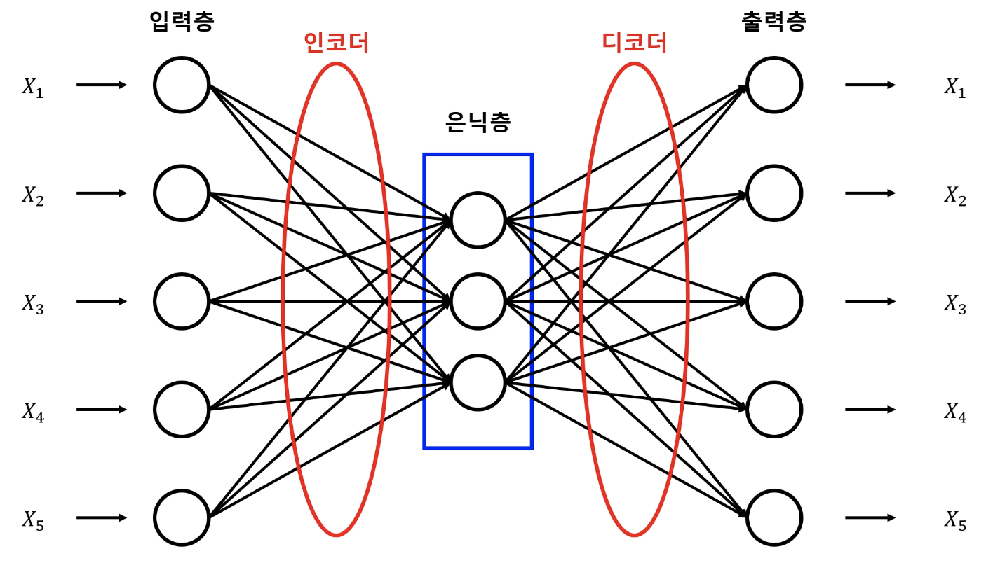

# 비지도 학습법 Autoencoder

* **머신러닝 학습 방법**
  * **지도 학습 (supervised learning)** : 프로그램에게 원하는 결과를 알려주고 학습하게 하는 방법
  * **비지도 학습(unsupervised learning)** : 입력값으로부터 데이터의 특징을 찾아내는 학습 방법

## 오토인코더 개념

**오토인코더는** 입력값과 출력값을 같게하는 신경망이며, **가운데 계층의 노드 수가 입력값보다 적은 것이** 독특한 점입니다. 이런 구조로 인해 **입력 데이터를 압축하는 효과를** 얻게 되고, 또 이 과정이 **노이즈 제거에** 매우 효과적이라고 알려져 있다.

* **오토인코더 기본 구조**

* **오토인코더의 핵심** : 입력층으로 들어온 데이터를 인코더를 통해 은닉층으로 내보내고, 은닉층의 데이터를 디코더를 통해 출력층으로 내보낸 뒤, 만들어진 출력값을 입력값과 비슷해지도록 만드는 가중치를 찾아내는 것이다.