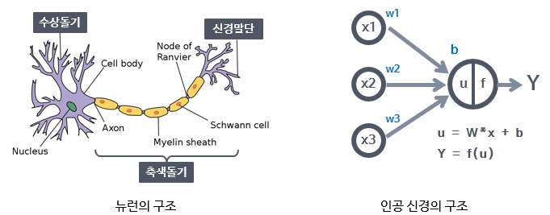

# 기본 신경망 구현

# 1. 인공 신경망의 작동원리

* **인공신경망(artificial neural network)** : 뇌를 구성하는 신경 세포. 즉 **뉴런(neuron)** 의 동작 원리에 기초한다.

  * **실제 뉴런과 인공 뉴런**

    

    > X : 입력
    >
    > xW : 가중치 곱
    >
    > +b : 편향 합
    >
    > f(u) : 활성화 함수(Sigmoid, ReLU)
    >
    > Y : 결과값
    >
    > Y = sigmoid( X * W + b)

  * **학습(learning) 또는 훈련(training)** : W와 b의 값을 변경해가면서 원하는 y 값을 만들어내는 과정

  * **활성화 함수(activation function)** : 인공신경망을 통과해온 값을 최종적으로 어떤 값으로 만들지 결정한다.

    

* **제한된 볼트만 머신(Restricted Boltzmann Machine, RBM)** : 심층 신경망을 효율적으로 학습시킬 수 있는 알고리즘

  * **역전파(backpropagation)** : 출력층이 내놓은 결과의 오차를 신경망을 따라 입력층까지 역으로 전파하며 계산해나가는 방식.

[프로그래밍 보기](https://github.com/LeeSM0518/deep-learning/blob/master/Neural-Network-Implementation/Classification-model-implementation.ipynb)

